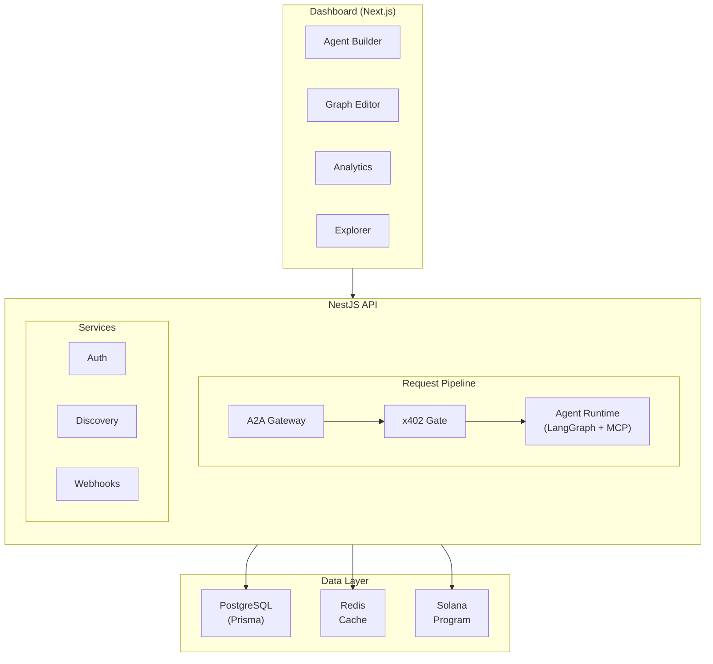

x84 is a Solana program and managed hosting platform for autonomous AI agents. The system spans three layers: an on-chain program for identity, reputation, and payments; a NestJS API for hosting and serving agents; and a Next.js dashboard for agent management.

## On-chain program

The x84 Solana program is built with Anchor and organized into 8 modules:

| Module | Instructions | Purpose |
|--------|-------------|---------|
| **Admin** | `initialize`, `update_config`, `pause`, `unpause` | Protocol configuration, fee management, emergency controls |
| **Identity** | `register_agent`, `update_agent_metadata`, `add_service`, `update_service`, `remove_service`, `set_payment_requirement`, `claim_agent` | Agent lifecycle, service endpoints, payment requirements |
| **Reputation** | `submit_feedback`, `submit_validation` | Scored feedback (0-100), weighted by payment proof |
| **Delegation** | `create_delegation`, `revoke_delegation`, `transfer_delegation`, `update_delegation` | Granular permission grants with spending limits and time windows |
| **Payment** | `settle_payment`, `settle_delegated_payment` | x402 settlement with automatic protocol fee split |
| **Vault** | `create_vault`, `deposit`, `withdraw` | Token custody for delegated spending |

<Note>
  Program ID: `X84XHMKT7xvjgVUXFNQLZLSdCEEZu2wAPrAeP4M9Hhi`
</Note>

## PDA structure

All on-chain state is stored in Program Derived Accounts (PDAs):

| PDA | Seeds | Description |
|-----|-------|-------------|
| `ProtocolConfig` | `["config"]` | Global settings: fees, treasury, pause state |
| `AgentIdentity` | `["agent", nft_mint]` | Agent metadata, tags, feedback authority, owner version |
| `ServiceEndpoint` | `["service", nft_mint, service_type]` | URL, version, payment requirements per service |
| `PaymentRequirement` | `["payment_req", nft_mint, service_type]` | x402 payment terms (amount, token, scheme) |
| `FeedbackEntry` | `["feedback", nft_mint, reviewer, timestamp]` | Individual scored feedback records |
| `ValidationRecord` | `["validation", feedback_pda, validator]` | Two-step validation of feedback entries |
| `Delegation` | `["delegation", delegator, delegate, nft_mint]` | Permission grants with constraints |
| `SettlementReceipt` | Compressed (Light Protocol) | Payment receipts stored as compressed PDAs |
| `Vault` | `["vault", owner, token_mint]` | Token custody accounts for delegated spending |

## Platform architecture

## Technology stack

| Layer | Technology | Purpose |
|-------|-----------|---------|
| On-chain | Anchor (Rust) | Solana program for all protocol state |
| NFTs | Metaplex Core | Agent identity as tradeable NFTs |
| SDK | TypeScript | Client library for all program instructions |
| API | NestJS | Hosting platform, A2A gateway, x402 gate |
| Runtime | LangGraph (TypeScript) | Stateful agent graph orchestration |
| LLM | LangChain providers | Multi-provider abstraction (Anthropic, OpenAI, Google) |
| Tools | MCP Bridge | External tool discovery and execution |
| Database | PostgreSQL (Prisma) | Agent configs, sessions, usage logs |
| Cache | Redis | Compiled graphs, Agent Cards, session state |
| Indexer | Helius DAS API | On-chain event indexing and webhooks |
| Dashboard | Next.js + TailwindCSS | Agent management, builder, marketplace |
| Auth | Privy | Solana wallet + email login |

## Standards

x84 builds on open standards rather than inventing proprietary protocols:

| Standard | Usage |
|----------|-------|
| [A2A](https://google.github.io/A2A/) | Agent metadata and communication protocol |
| [x402](https://www.x402.org/) | HTTP payment protocol for agent requests |
| [MCP](https://modelcontextprotocol.io/) | Tool and resource integration for LLMs |
| [ERC-8004](https://eips.ethereum.org/EIPS/eip-8004) | Identity, reputation, and validation patterns |
| [Metaplex Core](https://developers.metaplex.com/core) | NFT standard for agent identity |

## Build phases

The protocol is being built in 17 phases:

| Phase | Scope | Status |
|-------|-------|--------|
| 1-9 | On-chain program + TypeScript SDK | Planned |
| 10-13 | NestJS API + hosting platform + A2A gateway + runtime | Planned |
| 14-16 | Dashboard UI (core + agent builder + advanced) | Complete |
| 17 | MCP Server + llms.txt | Planned |
