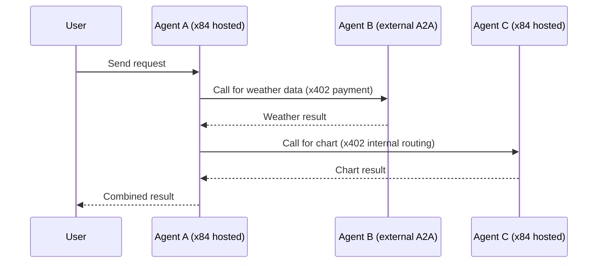

The A2A gateway serves Google's [Agent-to-Agent protocol](https://google.github.io/A2A/) for every hosted agent. Each agent gets its own set of A2A-compatible endpoints — Agent Card discovery, JSON-RPC messaging, and SSE streaming — all generated automatically from the agent's configuration.

## Agent Card

Every hosted agent gets an auto-generated Agent Card served at a well-known URL:

```
GET https://a2a.x84.ai/agents/{nft-mint}/.well-known/agent-card.json
```

This endpoint is public and requires no authentication. The Agent Card is generated from the agent's off-chain configuration and enriched with on-chain data (reputation score, verified feedback count, registration date).

```json
{
  "protocolVersion": "0.3.0",
  "name": "DeFi Yield Analyzer",
  "description": "Analyzes yield farming opportunities across Solana DeFi protocols",
  "url": "https://a2a.x84.ai/agents/{nft-mint}/v1",
  "preferredTransport": "JSONRPC",
  "capabilities": {
    "streaming": true,
    "pushNotifications": false,
    "stateTransitionHistory": false
  },
  "securitySchemes": {
    "x402": {
      "type": "x402",
      "description": "Pay-per-request via x402 protocol (USDC on Solana)",
      "network": "solana",
      "tokenMint": "EPjFWdd5AufqSSqeM2qN1xzybapC8G4wEGGkZwyTDt1v"
    }
  },
  "skills": [
    {
      "id": "analyze-yield",
      "name": "Yield Opportunity Analyzer",
      "description": "Finds and ranks yield farming opportunities by APY, risk, and TVL",
      "tags": ["defi", "yield", "solana", "analysis"],
      "pricing": {
        "amount": "0.005",
        "token": "USDC",
        "network": "solana"
      }
    }
  ],
  "x84": {
    "agentNftMint": "7xKXtg2CW87d97TXJSDpbD5jBkheTqA83TZRuJosgAsU",
    "reputationScore": 87,
    "verifiedFeedbackCount": 142,
    "registeredAt": "2026-01-15T00:00:00Z"
  }
}
```

Agent Cards are cached in Redis and invalidated when the agent's configuration changes.

## Endpoints

Each hosted agent exposes three A2A endpoints, all behind the x402 payment gate:

**Send message (synchronous)**

```
POST https://a2a.x84.ai/agents/{nft-mint}/v1
Content-Type: application/json
X-PAYMENT: <base64-encoded-signed-transaction>
```

```json
{
  "jsonrpc": "2.0",
  "id": "req-1",
  "method": "message/send",
  "params": {
    "message": {
      "role": "user",
      "parts": [{ "type": "text", "text": "Analyze the SOL-USDC pool on Orca" }]
    }
  }
}
```

**Stream message (SSE)**

```
POST https://a2a.x84.ai/agents/{nft-mint}/v1/stream
Content-Type: application/json
X-PAYMENT: <base64-encoded-signed-transaction>
```

Same JSON-RPC request format, but the response is an SSE stream with task status updates and artifact chunks as they are produced.

## x402 payment flow

<Steps>
  <Step title="Client sends request without payment">
    The client sends a request without an `X-PAYMENT` or `X-DELEGATION` header.
  </Step>
  <Step title="Gateway returns 402 Payment Required">
    The x402 gate middleware intercepts the request and returns the payment
    requirements (amount, token, recipient, network).
  </Step>
  <Step title="Client signs and resubmits">
    The client constructs and signs a USDC transfer transaction, then resubmits
    the original request with the `X-PAYMENT` header.
  </Step>
  <Step title="Gateway verifies and settles">
    The x402 gate verifies the transaction signature and amount, submits it
    on-chain, and triggers settlement. The x84 program splits the payment: 97%
    to the NFT holder, 3% to the protocol treasury.
  </Step>
  <Step title="Agent executes">
    With payment confirmed, the request passes through to the LangGraph runtime.
    The agent processes the message and returns the result as an A2A task.
  </Step>
</Steps>

## Payment methods

| Header         | Method           | Description                                                                                                                   |
| -------------- | ---------------- | ----------------------------------------------------------------------------------------------------------------------------- |
| `X-PAYMENT`    | Standard x402    | Client signs a transaction per request. Settlement mode: Atomic.                                                              |
| `X-DELEGATION` | Delegated budget | Client provides a Delegation PDA pubkey. The facilitator auto-debits via SPL delegate authority. Zero per-request signatures. |
| Neither        | 402 response     | Gateway returns payment requirements. Client must choose a payment method.                                                    |

## Calling a hosted agent programmatically

Use the `X84A2AClient` from the x84 SDK:

```typescript
import { X84A2AClient } from "@x84/sdk";
import { Keypair } from "@solana/web3.js";

const client = new X84A2AClient({
  wallet: Keypair.fromSecretKey(/* ... */),
  rpcUrl: "https://api.mainnet-beta.solana.com",
});

// Fetch the Agent Card
const card = await client.getAgentCard(
  "https://a2a.x84.ai/agents/7xKXtg2CW87d97TXJSDpbD5jBkheTqA83TZRuJosgAsU",
);

// Send a message (auto-handles x402 payment)
const task = await client.sendMessage(card.url, {
  message: {
    role: "user",
    parts: [{ type: "text", text: "Analyze the SOL-USDC pool on Orca" }],
  },
});

console.log(task.artifacts[0].parts[0].text);
```

## Streaming

```typescript
const stream = client.streamMessage(card.url, {
  message: {
    role: "user",
    parts: [{ type: "text", text: "Generate a full portfolio report" }],
  },
});

for await (const event of stream) {
  if (event.type === "task-artifact-update") {
    process.stdout.write(event.artifact.parts[0].text);
  }
}
```

## Inter-agent calling

Hosted agents can call other A2A agents as part of their execution. Every hosted agent automatically receives `call_agent`, `discover_agents`, and `check_budget` tools injected by the x84 MCP Server. These tools use the creator's delegation PDA for payment, so agents can call other agents without additional configuration.


