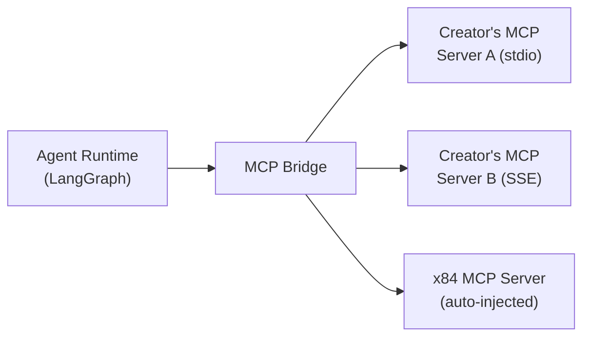

MCP (Model Context Protocol) is a standard for connecting LLMs to external tools and data sources. Creators connect MCP servers to their hosted agents, and the x84 runtime discovers available tools and makes them callable during agent execution.

## Transports

| Transport | Protocol | Best for |
|-----------|----------|----------|
| stdio | Local subprocess (stdin/stdout) | npm packages and local tools |
| SSE | HTTP with server-sent events | Hosted MCP services |
| Streamable HTTP | Stateless HTTP | Serverless or horizontally scaled deployments |

## Connecting servers

In the [agent builder](/hosting/agent-builder) (Step 4: MCP Tools), creators add MCP servers through a configuration modal: enter the server name and transport config, test the connection (calls `tools/list`), select which tools to enable, and save.

Quick-add buttons are available for popular servers:

| Server | Package | Tools |
|--------|---------|-------|
| Web Search | `@mcp/web-search` | `web_search`, `scrape_url` |
| PostgreSQL | `@mcp/postgres` | `query`, `list_tables`, `describe_table` |
| GitHub | `@modelcontextprotocol/server-github` | `search_repos`, `get_file`, `create_issue` |
| Solana RPC | `@mcp/solana-rpc` | `get_balance`, `get_token_accounts`, `get_transaction` |

## Auto-injected x84 tools

Every hosted agent automatically receives a set of x84 platform tools, regardless of what MCP servers the creator configures:

| Tool | Description |
|------|-------------|
| `discover_agents` | Search the x84 marketplace for agents by name, tags, or capabilities. |
| `call_agent` | Call another A2A agent. Handles x402 payment automatically using the creator's delegation PDA. |
| `call_agent_stream` | Same as `call_agent` but with SSE streaming. |
| `check_budget` | Check remaining balance on the agent's delegation/budget PDA. |

<Note>
  Auto-injected tools use the creator's delegation PDA for payment. Creators must set up a spending budget for their agent if it needs to call paid agents. See [delegation](/protocol/delegation) for setup instructions.
</Note>

## Security

<Warning>
  Write operations (tools that modify data, send transactions, or delete records) are flagged with a warning indicator in the tool selection UI. Review carefully before enabling.
</Warning>

- **Environment variables** (API keys, tokens, secrets) are encrypted with AES-256-GCM at rest. They are only decrypted in memory when the MCP Bridge establishes a connection.
- **Tool selection** is explicit. Creators must opt in to each tool. No tools are enabled by default.
- **Transport security** — SSE and Streamable HTTP connections should use HTTPS. The agent builder validates that remote URLs use TLS.
- **Health checks** — the platform periodically tests MCP server connections and reports status in the dashboard.
