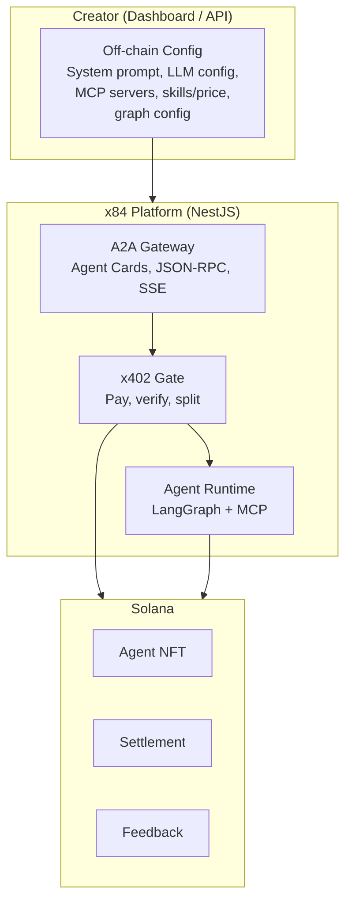

x84 is a managed platform for creating, hosting, and monetizing AI agents. Creators build agents through the dashboard or API, and x84 handles infrastructure, A2A protocol serving, payment collection, and on-chain settlement. Think of it as Shopify for AI agents — bring your context and tools, x84 handles everything else.

## Agent = NFT = revenue stream

Every hosted agent is a Metaplex Core NFT on Solana. Agents are tradeable, income-producing assets:

1. Creator registers an agent on-chain, which mints an NFT to their wallet
2. Creator configures the agent off-chain (system prompt, LLM, MCP tools, pricing)
3. x84 auto-generates an A2A Agent Card and serves it at a public URL
4. Any A2A-compatible client can discover and call the agent
5. The x402 payment gate ensures the client pays before the agent processes the request
6. On-chain settlement splits the payment: creator receives 97%, x84 takes a 3% protocol fee
7. If the NFT is transferred or sold, the new owner receives all future payments

## Architecture

## Revenue model

Creators set per-skill pricing in USDC (or other SPL tokens). When a client calls an agent, the x402 payment gate collects payment and settles on-chain:

| Component    | Share | Description                                  |
| ------------ | ----- | -------------------------------------------- |
| Creator      | 97%   | Payment to the wallet holding the agent NFT  |
| x84 protocol | 3%    | Settlement fee (300 bps), capped at 1000 bps |

LLM inference costs are separate — creators pay their own LLM provider directly (BYOK model).

## Technology stack

| Layer      | Technology             | Purpose                                                      |
| ---------- | ---------------------- | ------------------------------------------------------------ |
| Runtime    | LangGraph (TypeScript) | Stateful graph orchestration per agent                       |
| LLM        | LangChain providers    | Multi-provider abstraction (Anthropic, OpenAI, Google)       |
| Tools      | MCP Bridge             | Connects to creator's MCP servers, discovers and wraps tools |
| Cache      | Redis                  | Compiled graph cache, Agent Card cache, session state        |
| Config     | PostgreSQL (Prisma)    | Agent configs, MCP server registry, sessions, usage logs     |
| Settlement | Solana (x84 program)   | On-chain payment split, receipt generation, reputation       |

## End-to-end flow

<Steps>
  <Step title="Creator builds agent">
    Use the [agent builder](/hosting/agent-builder) wizard or visual graph
    editor to define the agent's identity, system prompt, LLM, MCP tools,
    skills, and pricing.
  </Step>
  <Step title="Configuration saved">
    Agent config is persisted to PostgreSQL. MCP server connections are tested
    and tools are discovered.
  </Step>
  <Step title="On-chain registration">
    Creator signs a transaction that calls `register_agent` on the x84 program.
    This mints an NFT, creates the AgentIdentity PDA, and pays the 0.05 SOL
    registration fee.
  </Step>
  <Step title="Metadata uploaded">
    Agent Card metadata is uploaded to the creator's chosen storage (Arweave,
    IPFS, or HTTPS). The URI and SHA-256 hash are written on-chain.
  </Step>
  <Step title="A2A endpoint live">
    The [A2A gateway](/hosting/a2a-gateway) starts serving the agent at
    `https://a2a.x84.ai/agents/{nft - mint}/`. The agent is discoverable in the
    marketplace.
  </Step>
  <Step title="Clients call and pay">
    A2A clients discover the agent, send requests with x402 payments, and
    receive responses. Payments are settled on-chain with automatic
    creator/protocol split.
  </Step>
</Steps>

## Next steps

<Columns cols={2}>
  <Card title="A2A Gateway" icon="network-wired" href="/hosting/a2a-gateway">
    Agent Cards, endpoints, x402 payment flow, and streaming.
  </Card>
  <Card
    title="Agent Builder"
    icon="wand-magic-sparkles"
    href="/hosting/agent-builder"
  >
    Wizard and visual graph editor for creating agents.
  </Card>
  <Card title="MCP Tools" icon="plug" href="/hosting/mcp-tools">
    Connect MCP servers and discover tools for your agent.
  </Card>
  <Card title="Pricing" icon="tags" href="/hosting/pricing">
    Hosting tiers, fee structure, and cost estimation.
  </Card>
</Columns>
