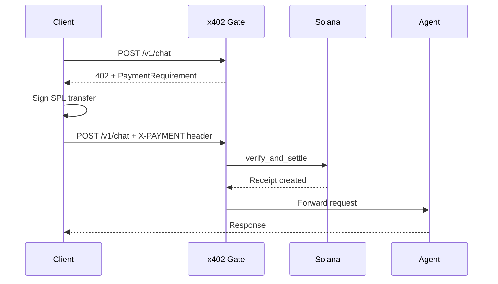

## What is x402

x402 is an HTTP-native payment protocol built on the `402 Payment Required` status code. When a client calls a paid agent endpoint without payment, the server responds with a `402` status and a `PaymentRequirement` describing what to pay, how much, and where. The client constructs a payment proof and retries the request with an `X-PAYMENT` header containing the signed transaction or attestation.

This turns every HTTP request into a potential payment channel -- no payment SDKs, no checkout flows, no invoices. The agent decides its price, the protocol enforces it on-chain.

## How x84 implements x402

Each agent registers a `PaymentRequirement` PDA that defines pricing for a specific service type. When a request hits the x402 gate:

1. The gate loads the `PaymentRequirement` for the target agent and service
2. If the request includes a valid `X-PAYMENT` header, the gate calls `verify_and_settle` on-chain
3. If the request includes an `X-DELEGATION` header, the gate settles via the delegation's pre-approved budget
4. If neither header is present, the gate returns a `402` response with the payment details



## Settlement modes

x84 supports three settlement modes, each suited to different trust and automation levels.

<Tabs>
  <Tab title="Atomic">
    The payer signs the transaction. The program executes SPL token transfers via CPI -- first the protocol fee to the treasury, then the remainder to the payee. The compressed receipt is created in the same instruction.

    **Use when**: the payer is online and can sign each request.
  </Tab>
  <Tab title="Attestation">
    The facilitator attests that payment already happened off-chain. No token transfer occurs on-chain -- only the receipt is created. The facilitator must be the registered signer in `ProtocolConfig`.

    **Use when**: payment was settled through an external channel (fiat, cross-chain, prepaid credits).
  </Tab>
  <Tab title="Delegated">
    The facilitator uses a pre-approved SPL Token delegate authority to transfer tokens from the payer's account. The `Delegation` PDA enforces spending constraints (per-tx limit, total budget, allowed tokens, expiry). No per-request signature from the payer.

    **Use when**: autonomous agents need to spend within a budget without human approval per request.
  </Tab>
</Tabs>

### Settlement mode comparison

| | Atomic | Attestation | Delegated |
|---|--------|-------------|-----------|
| Token transfer | On-chain CPI | Off-chain (trusted) | On-chain via SPL delegate |
| Payer signs | Yes | No | No |
| Facilitator required | No | Yes | Yes |
| Delegation PDA | Not used | Not used | Required |
| Use case | Standard user payments | External/fiat settlement | Autonomous agent budgets |

## Settlement fee

Every settlement deducts a protocol fee before the payee receives payment. The fee is defined in basis points on the `ProtocolConfig` account.

| Parameter | Value |
|-----------|-------|
| Default fee | 300 bps (3%) |
| Maximum cap | 1000 bps (10%) |
| Destination | `fee_treasury` wallet |
| Adjustable by | Protocol authority (governance) |

The fee is calculated as:

```
fee = amount * settlement_fee_bps / 10_000
payee_amount = amount - fee
```

Both `fee_amount` and `payee_amount` are recorded on the compressed receipt and emitted in the `PaymentSettled` event.

## Payment follows the NFT

The `pay_to` field on `PaymentRequirement` determines who receives payment. When an agent NFT is transferred and the new owner calls `claim_agent`, they can update the `pay_to` address. Whoever holds the NFT controls the revenue stream.

This means agent NFTs are income-producing assets. Transferring the NFT transfers all future payment revenue.

## PaymentRequirement PDA

Each agent can define one payment requirement per service type.

| Field | Type | Description |
|-------|------|-------------|
| `nft_mint` | `Pubkey` | Agent identity (NFT mint address) |
| `service_type` | `ServiceType` | MCP, A2A, API, or Web |
| `scheme` | `PaymentScheme` | `Exact` (fixed price) or `UpTo` (dynamic, up to amount) |
| `amount` | `u64` | Price in token's smallest unit (e.g., 1000000 = 1 USDC) |
| `token_mint` | `Pubkey` | SPL token mint (USDC, wrapped SOL, etc.) |
| `pay_to` | `Pubkey` | Destination wallet for payments |
| `description` | `String` | Human-readable description (max 200 chars) |
| `resource` | `String` | API endpoint path (max 200 chars) |
| `active` | `bool` | Whether this requirement is active |

**PDA seeds**: `[b"payment_req", nft_mint.as_ref(), service_type.seed()]`

## The verify_and_settle instruction

`verify_and_settle` is the single instruction that handles all payment settlement. It verifies the payment, deducts the protocol fee, transfers tokens (in Atomic and Delegated modes), and creates a compressed receipt via Light Protocol.

```rust
pub fn verify_and_settle(
    ctx: Context<VerifyAndSettle>,
    payment_id: [u8; 32],          // unique nonce (client-generated)
    tx_signature: [u8; 64],        // Solana tx sig (zeroed for Delegated mode)
    amount: u64,                   // payment amount in token's smallest unit
    resource: String,              // API endpoint path
    settlement_mode: SettlementMode, // Atomic | Attestation | Delegated
) -> Result<()>
```

<Steps>
  <Step title="Validation">
    The instruction checks that the payments module is not paused, the `PaymentRequirement` is active, and the amount meets the requirement (exact match for `Exact` scheme, at or below for `UpTo`).
  </Step>
  <Step title="Fee calculation">
    The protocol fee is calculated from `ProtocolConfig.settlement_fee_bps`.
  </Step>
  <Step title="Token transfer (mode-dependent)">
    **Atomic**: Two SPL CPI transfers -- fee to treasury, remainder to payee. Payer signs.

    **Attestation**: No transfer. Facilitator attests the payment happened externally.

    **Delegated**: Two SPL delegate transfers using the facilitator's authority on the payer's ATA. Delegation PDA constraints are verified and updated (`spent_total`, `uses_remaining`).
  </Step>
  <Step title="Receipt creation">
    A `CompressedPaymentReceipt` is created via CPI to the Light System Program. The receipt address is derived deterministically from the `payment_id`.
  </Step>
  <Step title="Event emission">
    The `PaymentSettled` event is emitted with all settlement details including `fee_amount`, `settlement_mode`, and delegation pubkey (if applicable).
  </Step>
</Steps>

## Compressed receipts with Light Protocol

Every settlement creates a payment receipt. At scale, receipts are the highest-volume account type in the protocol. x84 uses [Light Protocol](https://zkcompression.com) (ZK Compression) to store receipts as compressed PDAs instead of regular Solana accounts, eliminating rent costs entirely.

<Note>
Compressed PDAs store account data as hashes in Merkle trees, verified by zero-knowledge proofs. The data is rent-free and permanent.
</Note>

| Volume | Regular PDA rent | Compressed PDA cost | Savings |
|--------|-----------------|---------------------|---------|
| 1,000 receipts | ~3 SOL ($450) | ~0.01 SOL | 99.7% |
| 10,000 receipts | ~30 SOL ($4,500) | ~0.1 SOL | 99.7% |
| 100,000 receipts | ~300 SOL ($45,000) | ~1 SOL | 99.7% |

### CompressedPaymentReceipt struct

| Field | Type | Hashed | Description |
|-------|------|--------|-------------|
| `payment_id` | `[u8; 32]` | Yes | Unique nonce (client-generated) |
| `nft_mint` | `Pubkey` | Yes | Agent identity |
| `payer` | `Pubkey` | Yes | Who paid |
| `payee` | `Pubkey` | No | Who received payment |
| `amount` | `u64` | No | Total amount paid |
| `fee_amount` | `u64` | No | Protocol fee deducted |
| `token_mint` | `Pubkey` | Yes | SPL token used |
| `resource` | `String` | Yes | API endpoint path |
| `settlement_mode_raw` | `u8` | No | 0=Atomic, 1=Attestation, 2=Delegated |
| `extra_data_hash` | `[u8; 32]` | Yes | SHA-256 of tx_signature (64 bytes) + delegation_key (32 bytes) |
| `created_at` | `i64` | No | Unix timestamp |

<Accordion title="Why extra_data_hash instead of raw fields">
  Light Protocol's `LightHasher` supports a maximum of 12 fields. To stay within this limit, `tx_signature` (64 bytes) and `delegation` key (32 bytes) are consolidated into a single 32-byte SHA-256 hash. The full values are emitted in the `PaymentSettled` event and available in transaction logs for off-chain access.
</Accordion>

### Address derivation and anti-replay

Receipt addresses are deterministic, derived from the `payment_id`:

```rust
let (address, address_seed) = derive_address(
    &[b"compressed_receipt", &payment_id],
    &address_tree_pubkey,
    &program_id,
);
```

The Light System Program enforces address uniqueness. If the same `payment_id` is used twice, the creation is rejected, providing the same replay protection as a regular PDA `init` constraint.

### Address Lookup Table (ALT)

Settlement transactions include many accounts. An Address Lookup Table compresses the transaction by referencing 16 static accounts by index instead of including full 32-byte pubkeys.

```
Index  Account
─────  ───────────────────────────────
0-7    Light Protocol CPI v1 system accounts
8-10   Light Protocol tree accounts
11     Config PDA
12     Token Program (SPL)
13     Token Mint
14     Treasury Token Account
15     Facilitator
```

The ALT address is stored in `NetworkConfig.lightAlt` and created once per deployment via the deploy CLI:

```bash
pnpm x84 -n devnet -a create-alt
```

---

## Spending budgets

A budget is an on-chain spending allowance that lets agents or applications make x402 payments without requiring a human signature per request. It combines two Solana primitives:

1. **SPL Token approve** -- gives the x84 facilitator wallet transfer authority over the payer's token account
2. **x84 Delegation PDA** -- enforces granular constraints (per-tx limit, total budget, allowed tokens, expiry, use count)

Together, these allow the x402 gate to auto-debit payments within the budget's constraints. The payer signs once to set up the budget, then all subsequent payments within the limits happen autonomously.

### Budget setup

Creating a budget requires a single transaction with two instructions.

<Steps>
  <Step title="SPL Token approve">
    Authorize the x84 facilitator wallet as a delegate on the payer's token account. The approved amount should match the budget's `max_spend_total`.

    ```typescript
    import { createApproveInstruction } from "@solana/spl-token";

    const approveIx = createApproveInstruction(
      payerTokenAccount,     // payer's ATA
      facilitatorPubkey,     // x84 facilitator wallet
      payerPubkey,           // payer (owner of ATA)
      maxSpendTotal,         // budget ceiling in token units
    );
    ```
  </Step>
  <Step title="Create delegation">
    Create the Delegation PDA with `can_transact: true` and the desired constraints.

    ```typescript
    import { DelegationBuilder } from "@x84-ai/sdk";

    const { instruction, delegationPda, delegationId } =
      await new DelegationBuilder()
        .transact()
        .spendLimit(
          new BN(1_000_000),    // max 1 USDC per transaction
          new BN(10_000_000),   // max 10 USDC total budget
        )
        .tokens([usdcMint])
        .expiry(Math.floor(Date.now() / 1000) + 86400 * 30) // 30 days
        .uses(1000)             // max 1000 requests
        .build(program, payerPubkey, facilitatorPubkey, nftMint);
    ```
  </Step>
  <Step title="Send as single transaction">
    Bundle both instructions into one transaction so the budget is fully set up atomically.

    ```typescript
    const tx = new Transaction().add(approveIx, instruction);
    await sendAndConfirmTransaction(connection, tx, [payerKeypair]);
    ```
  </Step>
</Steps>

### Three payment paths in the x402 gate

When a request reaches a paid agent endpoint, the x402 gate checks for payment authorization in this order:

| Header | Mode | Description |
|--------|------|-------------|
| `X-PAYMENT` | Atomic or Attestation | Standard x402 flow. Client provides signed payment proof. |
| `X-DELEGATION` | Delegated | Budget flow. Client provides the delegation PDA address. Gate loads the delegation, verifies constraints, and auto-debits via SPL delegate authority. |
| Neither | 402 response | No payment provided. Gate returns `402 Payment Required` with the `PaymentRequirement` details. |

### On-chain constraint enforcement

When `verify_and_settle` is called with `SettlementMode::Delegated`, the program verifies all constraints before executing the transfer:

| Constraint | Field | Check |
|------------|-------|-------|
| Active | `delegation.active` | Must be `true` |
| Owner version | `delegation.owner_version` | Must match `agent_identity.owner_version` |
| Expiry | `delegation.expires_at` | Must be `0` (no expiry) or greater than current timestamp |
| Permission | `delegation.can_transact` | Must be `true` |
| Per-tx limit | `delegation.max_spend_per_tx` | `0` (unlimited) or `amount <= max_spend_per_tx` |
| Total budget | `delegation.max_spend_total` | `0` (unlimited) or `spent_total + amount <= max_spend_total` |
| Allowed tokens | `delegation.allowed_tokens` | Empty (any token) or contains `token_mint` |
| Uses remaining | `delegation.uses_remaining` | `0` (unlimited) or `> 0` |

After a successful delegated settlement, the program updates `delegation.spent_total += amount` and `delegation.uses_remaining -= 1` (if not unlimited).

### Budget revocation

A budget can be revoked in a single transaction that cancels both the delegation and the SPL Token approval.

```typescript
import { revokeDelegation } from "@x84-ai/sdk";
import { createRevokeInstruction } from "@solana/spl-token";

// Revoke the x84 delegation
const revokeDelIx = await revokeDelegation(program, {
  caller: payerPubkey,
  nftMint: agentId,
  delegationPda: delegationPda,
});

// Revoke the SPL Token delegate authority
const revokeApproveIx = createRevokeInstruction(
  payerTokenAccount,
  payerPubkey,
);

const tx = new Transaction().add(revokeDelIx.instruction, revokeApproveIx);
await sendAndConfirmTransaction(connection, tx, [payerKeypair]);
```

<Warning>
Budgets are also automatically invalidated when the agent NFT is transferred. The `claim_agent` instruction increments `owner_version`, which causes all existing delegations to fail the owner version check. No explicit revocation is needed.
</Warning>

### Budget use cases

<Accordion title="Marketplace subscriptions">
  A consumer creates a budget allowing an agent to charge up to 50 USDC/month for ongoing access. The agent's x402 gate auto-debits each request against the budget. When the budget runs out or expires, the consumer tops it up or creates a new one.
</Accordion>

<Accordion title="Inter-agent spending">
  A creator's primary agent needs to call sub-agents (translation, search, summarization). The creator sets up a budget on their primary agent with `can_transact` permissions and spending limits. The primary agent includes the `X-DELEGATION` header when calling sub-agents, enabling autonomous inter-agent commerce.
</Accordion>

<Accordion title="SDK programmatic access">
  An application uses a hot wallet to interact with paid agents. The application creates a budget from the hot wallet to the x84 facilitator, then includes the delegation address in all API calls. No human in the loop for each request.
</Accordion>

---

## SDK usage

<CodeGroup>
```typescript Set a payment requirement
import {
  setPaymentRequirement,
  ServiceType,
  PaymentScheme,
} from "@x84-ai/sdk";

const { instruction, paymentReqPda } = await setPaymentRequirement(program, {
  caller: ownerPubkey,
  nftMint: agentId,
  serviceType: ServiceType.A2A,
  scheme: PaymentScheme.Exact,
  amount: new BN(1_000_000), // 1 USDC (6 decimals)
  tokenMint: usdcMint,
  payTo: ownerPubkey,
  description: "LLM inference per request",
  resource: "/v1/chat",
});
```

```typescript Settle a payment
import { settle, SettlementMode } from "@x84-ai/sdk/settlement";
import { Rpc } from "@lightprotocol/stateless.js";

const rpc = new Rpc(connection);

const result = await settle({
  program,
  rpc,
  connection,
  nftMint: agentId,
  serviceType: ServiceType.A2A,
  amount: new BN(1_000_000), // 1 USDC
  resource: "/v1/chat",
  mode: SettlementMode.Atomic,
  payer: payerPubkey,
  payerTokenAccount: payerAta,
  payeeTokenAccount: agentOwnerAta,
  treasuryTokenAccount: config.treasuryTokenAccount!,
  tokenMint: config.tokenMint!,
  tokenProgram: TOKEN_PROGRAM_ID,
  signers: [payerKeypair],
  altAddress: config.lightAlt!,
});

console.log("TX:", result.txSignature);
console.log("Fee:", result.paymentSettled?.feeAmount.toString());
```
</CodeGroup>

<Warning>
Settlement transactions require ~100-150K compute units for Light Protocol proof verification. The `computeBudgetIx` returned by `buildVerifyAndSettleIx` sets a 500K CU limit. Do not remove it.
</Warning>

## PaymentSettled event

| Field | Type | Description |
|-------|------|-------------|
| `paymentId` | `[u8; 32]` | Unique payment nonce |
| `nftMint` | `Pubkey` | Agent identity |
| `payer` | `Pubkey` | Who paid |
| `payee` | `Pubkey` | Who received payment |
| `amount` | `u64` | Total amount |
| `feeAmount` | `u64` | Protocol fee deducted |
| `tokenMint` | `Pubkey` | SPL token used |
| `resource` | `String` | API endpoint |
| `settlementMode` | `SettlementMode` | Atomic, Attestation, or Delegated |
| `txSignature` | `[u8; 64]` | Full transaction signature |
| `delegation` | `Option<Pubkey>` | Delegation PDA (if Delegated mode) |

## RPC requirements

<Tip>
Querying compressed receipt accounts requires an RPC provider that supports ZK Compression. Standard Solana RPC methods cannot access compressed state. Supported providers: **Helius** (recommended) and **Triton**.
</Tip>

```typescript
import { Rpc } from "@lightprotocol/stateless.js";

const rpc = new Rpc(connection);

// By exact address (when payment_id is known)
const account = await rpc.getCompressedAccount(bn(address.toBytes()));
const receipt = coder.types.decode("CompressedPaymentReceipt", account.data.data);

// All receipts by program owner
const accounts = await rpc.getCompressedAccountsByOwner(programId);
```
